1.

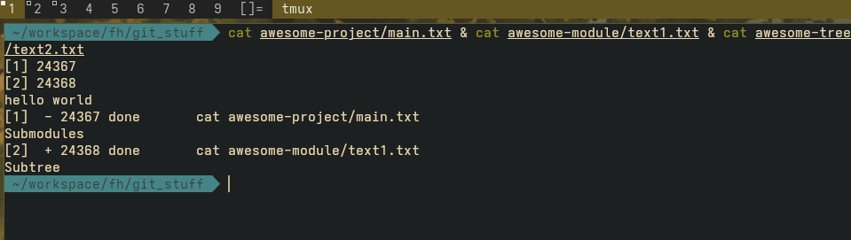

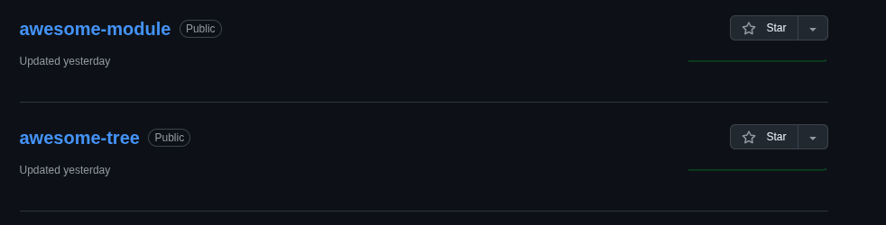

------------------------------------
2. 

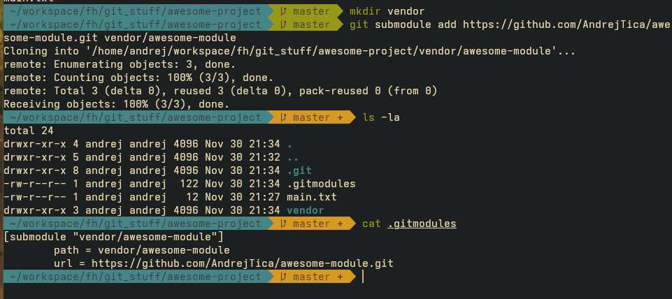

The command for creating a submodule:

```git submodule add https://github.com/AndrejTica/awesome-module.git vendor/awesome-module```

Now we have a hidden .gitmodules file in the root of our project. It contains the link to the
submodule. This submodule is now always locked to a specific commit in awesome-module.
The submodule now also contains its own .git directory. 

-------------------------------------
3.

After creating the awesome-project repo on github, we can add it locally as our remote origin.

```git remote add origin https://github.com/AndrejTica/awesome-project.git```

We can now see that on github the vendor/awesome-module is a submodule and its pinned to a commit.
If we click on it, we go straight to awesome-module github project. 

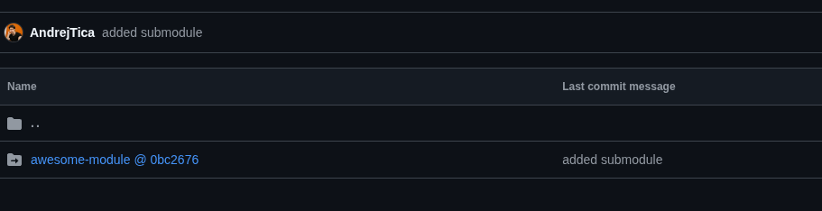

---------------------------------------
4.

After cloning the project again from the remote repo, we can see that actually vendor/awesome-module
is completely empty.

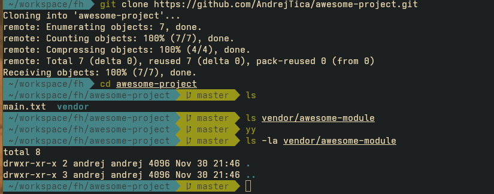

We need to add the --recursive flag to the clone command for it to work.


```git clone --recursive https://github.com/AndrejTica/awesome-project.git```

now we can see the repo is actually there.

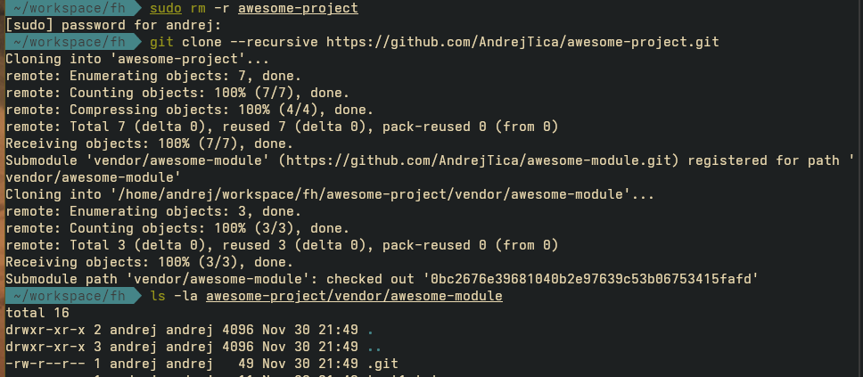

-----------------------------------------------
5. 

After running 

```git subtree add https://github.com/AndrejTica/awesome-tree.git main --squash```

we see that the file from awesome-tree is there, but its not a git repository. No entry in 
.gitmodules as well. 

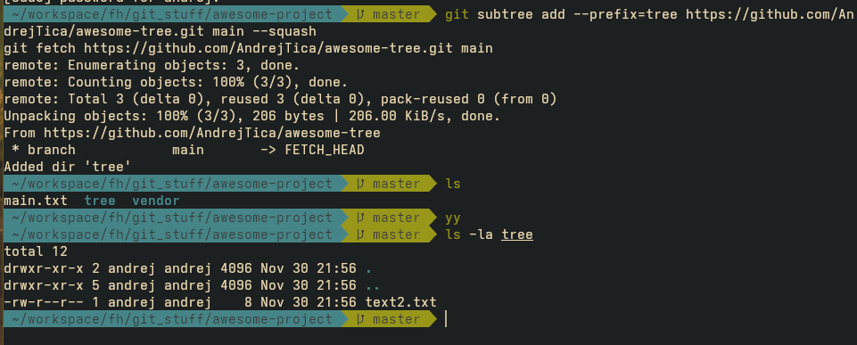

- "prefix" flag is to specify the directory in which the subtree should be copied into. 
- "squash" flag is optional to not pollute the main projects commit history with that of the tree module.
- we can also specify which branch specifically. 

The differences between subtree and submodule:

- Submodule: your project depends on another repo at a specific commit, which stays an independent Git repo inside your tree.
- Subtree: your project absorbs the other repo’s files into a subdirectory and tracks them as if they were its own, with special commands to sync changes.

----------------------------------------------
6.

Simply:

```git push origin master```

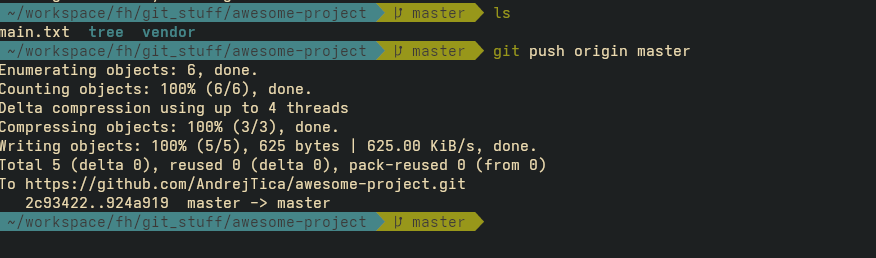

----------------------------------------------
7. 

With a subtree, a simple pull is enough.

```git pull```

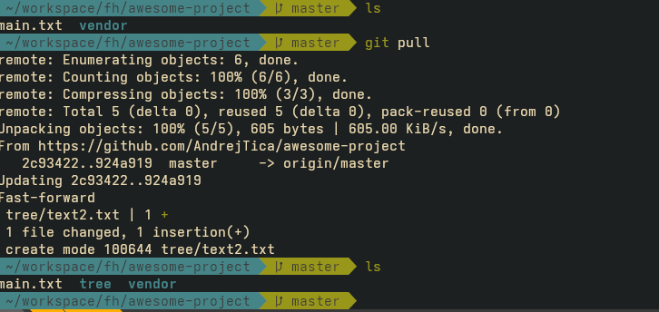

----------------------------------------------
8. 

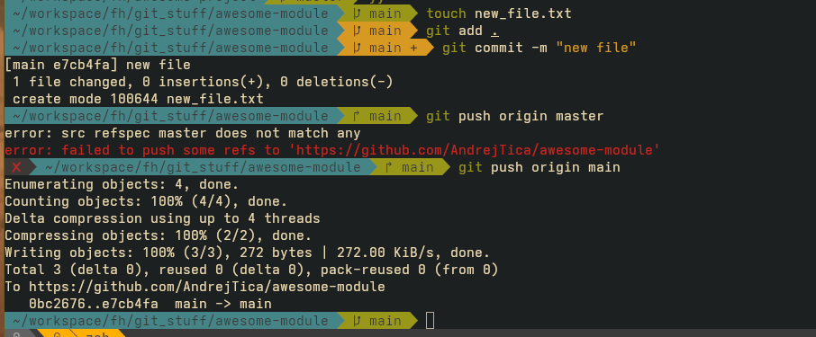

----------------------------------------------
9. 

After pushing to awesome-module remote, we go up to the root project and do a git pull.
We will see that new commits have been added to vendor/awesome-project. We need to commit and push
those new commits:
So we need two pushes, in the submodule repo and one to update the commit of it in the root repo.

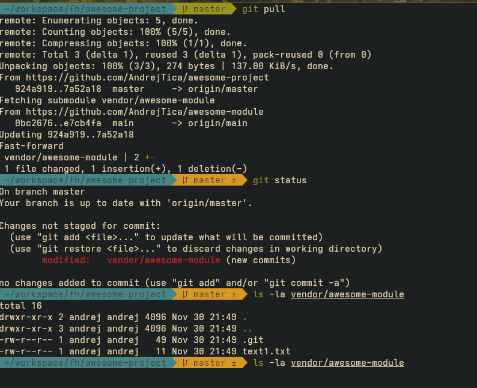


Then other users of the awesome-project need to do:


```git submodule update --remote vendor/awesome-module```

As a simple git pull won't get the new submodule changes.


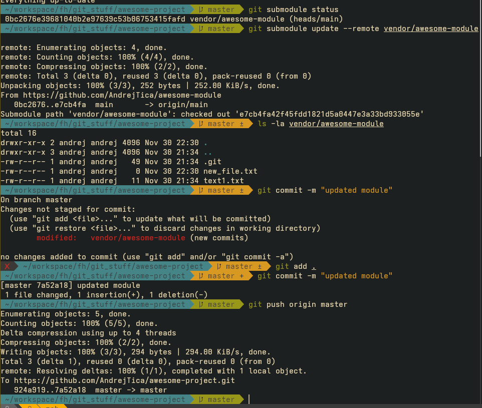

----------------------------------------------
10. 

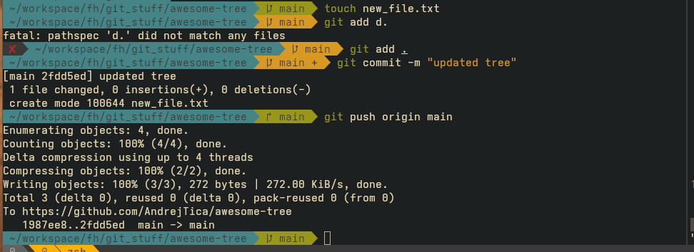

----------------------------------------------
11.

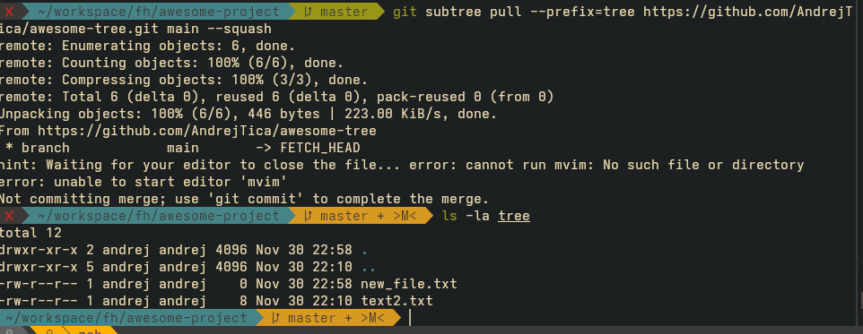

git subtree pull fetches and merges the new changes from the awesome-tree repo and creates
a new squashed merge commit.
Unlike submodules, we don’t have to update the merge pointer + run a special update command in other clones: the subtree contents are just normal files 
so a simple git pull on awesome-project will bring them in for everyone.


